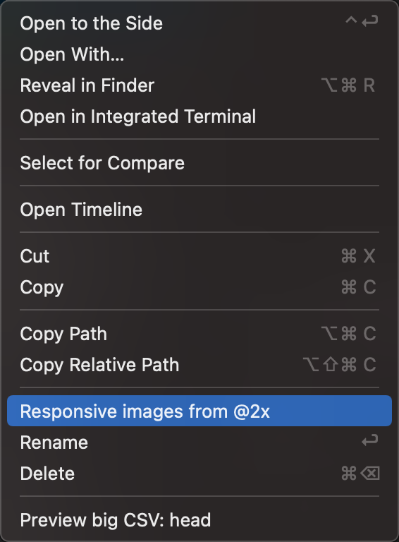
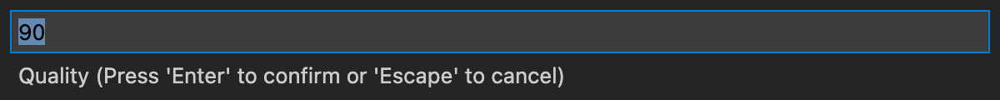
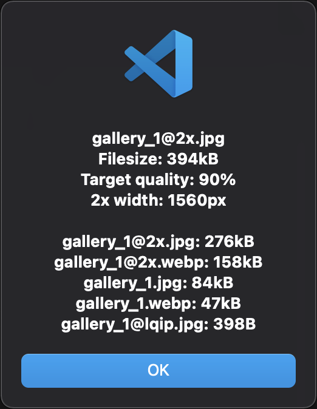

# Responsive images

## Requirements - macOS
```bash
brew install imagemagick jpegoptim pngquant webp
```

## Requirements - Linux
```bash
sudo apt install imagemagick jpegoptim pngquant webp
```

## Usage
1. Right click on the **2x** image (`*@2x.jpg`, `*@2x.png`, `*@2x.webp`)
1. Select `Responsive images from @2x`
1. Set optimization quality (used by `jpegoptim` and `cwebp`, default: `90`)
1. The following files will be generated (overwritten if exists) and optimized:
	- **jpg** file selected (`sample@2x.jpg`)
		- `sample@2x.jpg`
		- `sample.jpg`
		- `sample@2x.webp`
		- `sample.webp`
		- `sample@lqip.jpg`
	- **png** file selected (`sample@2x.png`)
		- `sample@2x.png`
		- `sample.png`
		- `sample@2x.webp`
		- `sample.webp`
		- `sample@lqip.jpg`
	- **webp** file selected (`sample@2x.webp`)
		- `sample@2x.jpg`
		- `sample.jpg`
		- `sample@2x.webp`
		- `sample.webp`
		- `sample@lqip.jpg`

## Screenshots
### Right click menu


### Set quality


### Results

